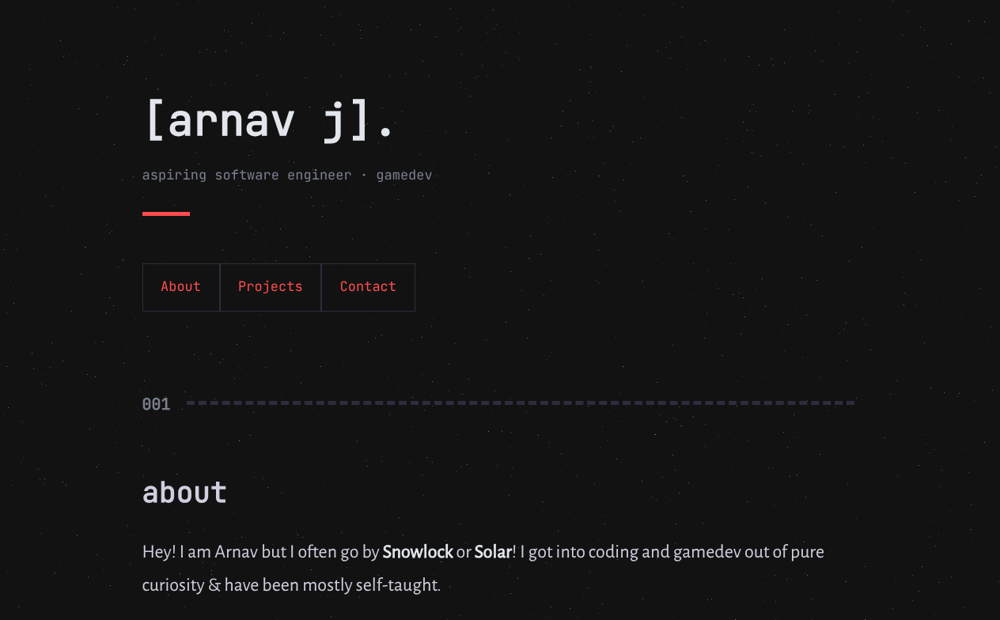
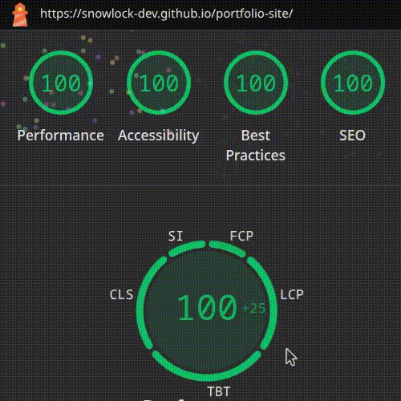
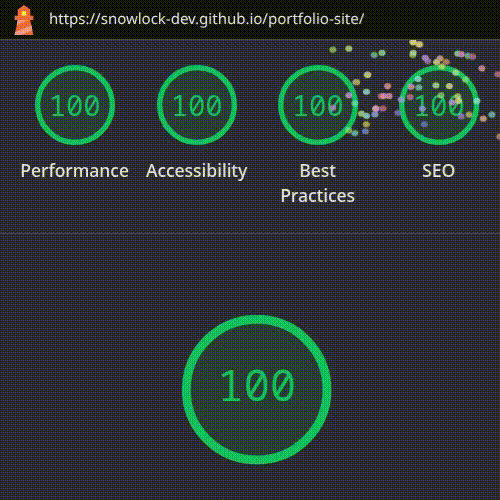

# Portfolio

---

A high-performance, minimalist portfolio focused on speed and simplicity!

## Lighthouse Report (Viewing)

<table>
  <tr>
    <td align="center">
      
      
Desktop
      <em>(consistent 99-100 TOTAL)</em>
      

    </td>
    <td align="center">
      
      
Mobile
      <em>(consistent >95 TOTAL)</em>
      

    </td>
  </tr>
</table>

## Inspiration && Credits

This site was inspired by: [rexim's site](rexim.github.io)

Background stars pattern from: [nnnoise](https://www.fffuel.co/nnnoise/)

Icons for the carousel by: [marwin1991/profile-technology-icons](https://github.com/marwin1991/profile-technology-icons/tree/main/icons)

Favicon by: [FaviconGenerator](https://favicongenerator.io/#text)